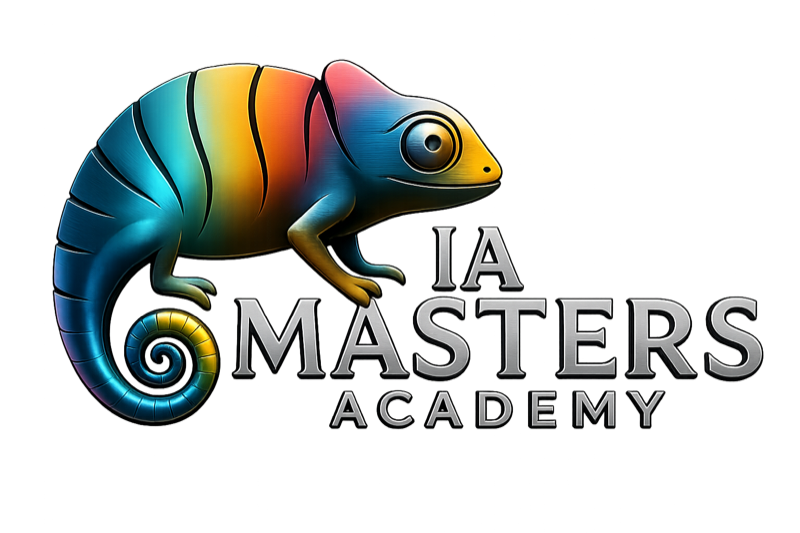

<p align="center">
  
</p>

<h1 align="center">content-engine</h1>

<p align="center">
  <em>Skill agéntica para crear contenido de redes sociales hablando con tu agente.<br>
  Castellano. Multi-modelo de imagen. Publica solo. Cero nodos de n8n.</em>
</p>

<p align="center">
  <a href="https://github.com/iamasters-academy/content-engine/releases"></a>
  <a href="LICENSE"></a>
  <a href="https://docs.claude.com/en/docs/claude-code"></a>
  <a href="https://fal.ai/models/fal-ai/nano-banana-2"></a>
  <a href="https://www.linkedin.com/in/angel-aparicio92"></a>
  <a href="https://iamastersacademy.com"></a>
</p>

---

## 🚀 Instalación en 30 segundos

**Si tienes [Claude Desktop](https://claude.com/download) (Pro o Max) o Claude Cowork, abre el chat y pega este mensaje exacto:**

```
Instala la skill content-engine desde
https://github.com/iamasters-academy/content-engine
y guíame en el setup paso a paso
```

Claude clonará el repo, ejecutará el wizard de configuración, te entrevistará para construir tu brief de marca personal (~10 min) y publicará tu primer post real en LinkedIn o Instagram (~5 min). Total: ~15-20 min la primera vez.

> 💡 **Para no técnicos**: la skill te lleva de la mano por las 3 cuentas que necesitas, las API keys, el modelo de imagen que prefieras y tu brief de marca. No tienes que recordar nada de antemano. Si te atascas, le dices a Claude "no entiendo este paso" y te lo explica.

¿No tienes Claude Desktop todavía? [Descárgalo aquí](https://claude.com/download). ¿No sabes qué plan necesitas? Ver [💰 Coste real](#-coste-real) abajo.

---

## Qué es

**content-engine** es una skill de Claude Code que reemplaza el workflow visual de marketing (n8n / Make / Zapier) por una sola conversación. Le hablas. Piensa. Publica.

Tres capas:

1. **Wizard interactivo** — la skill detecta si es tu primera vez y te guía a crear las 3 cuentas necesarias (Fal, Groq, Upload-Post), pegar las API keys y elegir tu modelo de imagen preferido. Cero docs externas.
2. **Motor agéntico** — 6 fases conversacionales: brief de marca, procesar input variado (texto/audio/vídeo/URL/PDF), research online, generar 5 piezas adaptadas, generar imagen, publicar. Todo en el chat.
3. **Multi-modelo de imagen** — `nano-banana-2` (Google) por defecto, pero soporta Flux, OpenAI gpt-image-1, o cualquier otro modelo de Fal vía URL. Sin tocar código.

## Para quién

- Emprendedor que publica en redes y odia el cross-posting
- Freelancer de marketing que quiere acelerar su producción de contenido
- Dueño de pequeño negocio que no tiene community manager
- Cualquiera que ya use Claude Code y quiera dejar de usar n8n para esto

No requiere conocimientos de programación. Sí requiere paciencia para configurarlo la primera vez (~15-20 min de wizard guiado).

## Qué te da el primer día

- ✅ Skill instalada y funcional en menos de 20 minutos
- ✅ Tu brief de marca personal en YAML, reutilizable cada semana
- ✅ Tu primera generación de 5 piezas adaptadas (LinkedIn, X, Instagram, YouTube short, TikTok)
- ✅ Tu primer post real publicado en LinkedIn + Instagram
- ✅ Imagen agéntica generada con `nano-banana-2` o el modelo que elijas
- ✅ Multi-modelo desde el día 1: cambias hablando, no tocando código
- ✅ Edición de imagen con foto referencia (sales tú en las imágenes)
- ✅ Privacidad por defecto: tus claves están en `.env.local`, gitignored

## 💰 Coste real

**Importante leerlo antes de instalar.** content-engine es gratis y open source, pero los servicios externos a los que se conecta tienen sus propios costes.

| Concepto | Coste | Cuándo se paga |
|---|---|---|
| content-engine (este repo) | **Gratis** (MIT) | Nunca |
| Claude Desktop app | Gratis (descarga) | Nunca |
| **Anthropic Pro** | **$20/mes** | Mínimo necesario para que la skill funcione bien |
| Anthropic Max | $100-200/mes | Solo si haces muchísimo contenido o sesiones largas |
| **Fal.ai** | Pago por imagen | ~$0.04 por imagen con `nano-banana-2`. Sin suscripción |
| Groq | Free tier | Solo si pasas audio/vídeo. Plan gratuito sobra para uso personal |
| Upload-Post | Free 10 posts/mes | Si superas 10/mes, planes desde $9/mes |
| OpenAI (opcional) | Pago por imagen | Solo si eliges OpenAI como proveedor de imagen alternativo |

**Conclusión**: el coste mínimo realista para empezar es **$20/mes de Anthropic Pro + ~1-3€/mes en imágenes Fal**. Todo lo demás está cubierto por planes gratis para uso personal típico (1-2 posts/semana).

## Instalación alternativa (sin prompt conversacional)

Si prefieres clonar manualmente:

```bash
git clone https://github.com/iamasters-academy/content-engine.git ~/.claude/skills/content-engine
cd ~/.claude/skills/content-engine
cp .env.example .env.local
# Edita .env.local con tus API keys
```

Detalle completo en [`docs/installation.md`](docs/installation.md).

## Después de instalar

Lo más útil para arrancar:

| Comando / acción | Qué hace |
|---|---|
| Wizard inicial (auto la 1ª vez) | Te lleva por cuentas, keys, modelo y brief. ~15-20 min |
| `/content-engine` o "usa content-engine" | Activa la skill en cualquier sesión Claude |
| "Genera contenido para esta idea" | Flujo completo: 5 piezas + imagen + publicación |
| "Cambia el modelo de imagen a X" | Multi-modelo en caliente, sin tocar código |
| "Edita esta foto mía y ponme en una oficina" | Modo edición con foto referencia |

Ver ejemplos completos en [`docs/examples.md`](docs/examples.md).

## Tools incluidas

```
tools/
├── image_engine.py          Selector — único punto de entrada para imagen
├── fal_image.py             Cliente Fal.ai (multi-modelo + edición)
├── openai_image.py          Cliente OpenAI gpt-image-1 + edits
├── groq_transcribe.py       Cliente Groq Whisper (audio/vídeo)
├── upload_post.py           Cliente Upload-Post API (LI, IG, X, TikTok…)
├── validate_env.py          Valida que tus API keys funcionan (ping real)
└── render_dashboard.py      Dashboard HTML opcional para community managers
```

Cada tool es stdlib pura — cero `pip install` requerido.

## Estructura del repo

```
content-engine/
├── SKILL.md                    # Instrucciones agénticas (las lee Claude)
├── README.md                   # Este archivo
├── LICENSE                     # MIT
├── CITATION.cff                # Citación académica
├── .env.example                # Plantilla de claves (copia a .env.local)
├── .gitignore                  # Protege secrets + assets generados
├── assets/
│   └── logo.png                # Logo IA Masters Academy
├── tools/                      # 7 clientes Python stdlib
├── templates/
│   ├── brief.yaml.template     # Schema brief de marca
│   ├── linkedin.md             # Reglas plantilla LinkedIn
│   ├── instagram.md
│   ├── x-thread.md
│   ├── youtube-short.md
│   ├── tiktok.md
│   └── dashboard.html.template # Dashboard opcional
├── data/
│   ├── briefs/                 # Tus briefs (gitignored)
│   ├── image_config.yaml       # Modelo elegido (gitignored)
│   ├── upload_post_config.yaml # User Upload-Post (gitignored)
│   └── inbox-redes/            # Outputs por fecha (gitignored)
├── docs/
│   ├── onboarding-flow.md      # Qué pasa en el primer arranque
│   ├── installation.md         # Setup manual paso a paso
│   ├── quickstart.md           # Tu primer post en 10 min
│   └── examples.md             # Casos reales
└── .github/
    └── CODEOWNERS              # Mantenedor: @angelapaia
```

## Privacidad y seguridad

- ✅ **Tus API keys nunca llegan a este repo.** Viven en `.env.local`, archivo gitignored. Si haces fork y commit, no se suben.
- ✅ **Tus briefs de marca y outputs son tuyos.** Carpetas `data/briefs/` y `data/inbox-redes/` están gitignored. Cero exfiltración accidental.
- ✅ **Tu username de Upload-Post tampoco se sube.** Va a `data/upload_post_config.yaml`, también gitignored.
- ✅ **Cero telemetría.** Esta skill no manda datos a nadie. Habla solo con Anthropic, Fal, Groq y Upload-Post — los servicios que tú mismo configuras.
- ✅ **Permisos mínimos.** La skill solo lee y escribe dentro de su propia carpeta. No toca tu sistema.

Si encuentras una vulnerabilidad o un bug que comprometa la privacidad, abre un [issue privado](https://github.com/iamasters-academy/content-engine/security/advisories) o escribe a `aaparicio@iamastersacademy.com`.

## Contribuir

Esta es una implementación de referencia. Forks bienvenidos. Pull requests bienvenidos si mantienen la skill en su misma línea: agéntica, conversacional, cero dependencias donde sea posible, idioma del usuario configurable.

Ver [`CITATION.cff`](CITATION.cff) si construyes encima de esto y quieres citar.

## Licencia

[MIT](LICENSE). Úsala. Modifícala. Compártela. Cobra por servicios encima de ella si quieres. Solo mantén el aviso de copyright.

---

<p align="center">
  <sub>
    Construido por <a href="https://www.linkedin.com/in/angel-aparicio92">Angel Aparicio</a> ·
    <a href="https://iamastersacademy.com">IA Masters Academy</a> ·
    <a href="https://github.com/iamasters-academy">@iamasters-academy</a> ·
    <code>aaparicio@iamastersacademy.com</code>
  </sub>
</p>
